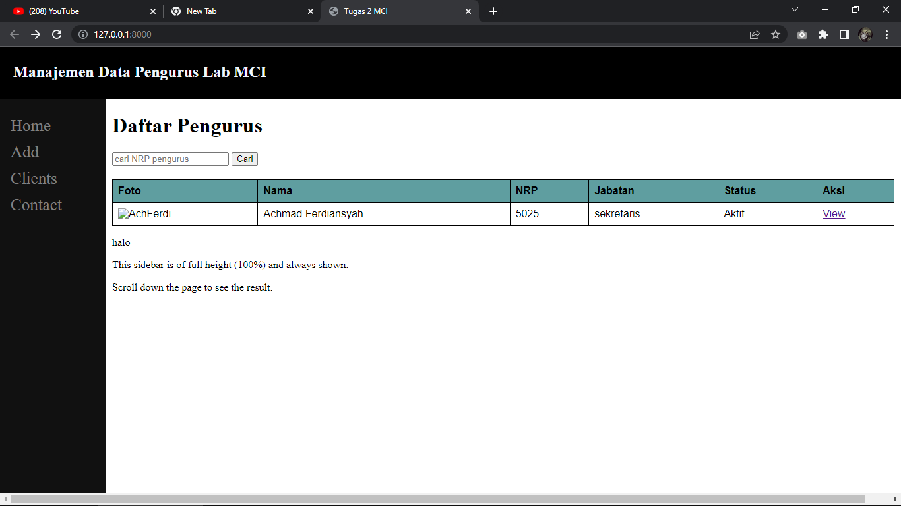

# Final Project Oprec MCI 2022

## Nama Aplikasi

Aplikasi pengelolaan database kepengurusan lab MCI.
  
Deskripsi:  
Aplikasi ini dibuat dengan tujuan untuk mempermudah mengelola data pengurus di lab MCI

## Fitur Aplikasi

List fitur pada aplikasi ini adalah sebagai berikut.

1. Menampilkan data pengurus
2. Menambah data pengurus
3. Mengubah data pengurus
4. Menghapus data pengurus
5. Mencari data pengurus berdasarkan kriteria tertentu

## Tampilan Aplikasi

### Fitur 1: Menampilkan Data Pengurus (tampilan sementara)

(screenshot fitur 1)

### Fitur 2: ...

(screenshot fitur 2)

### Dst
